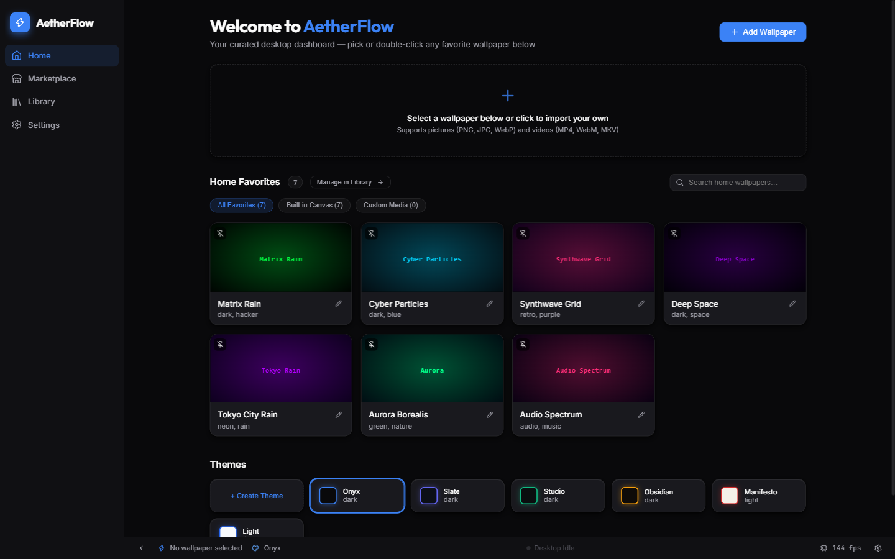
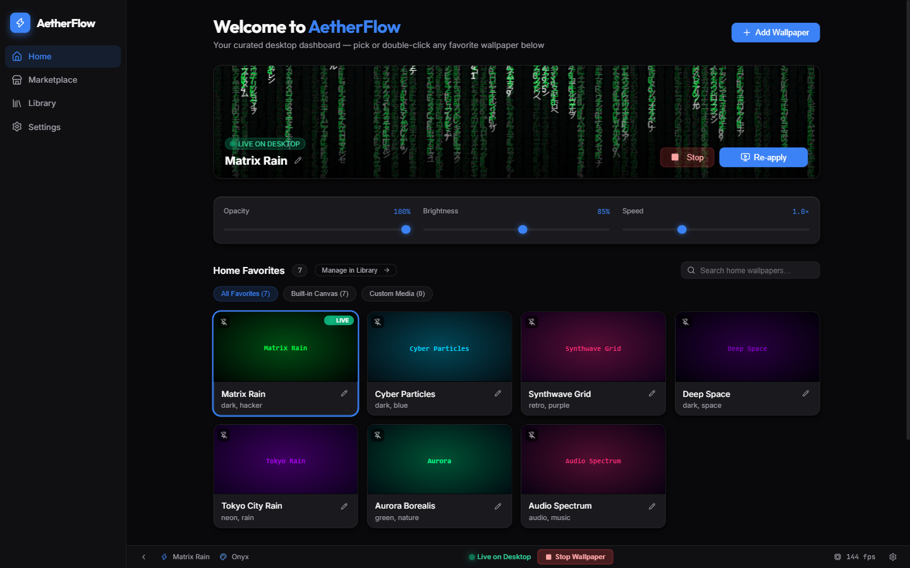
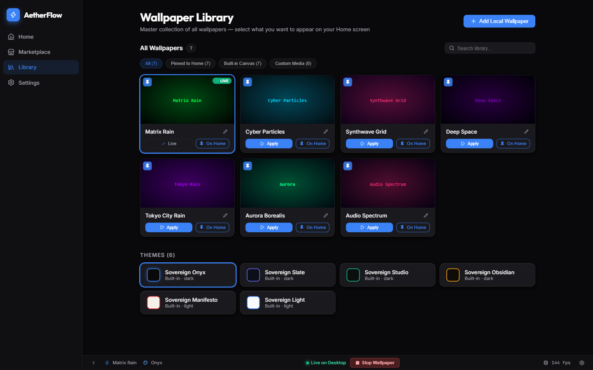
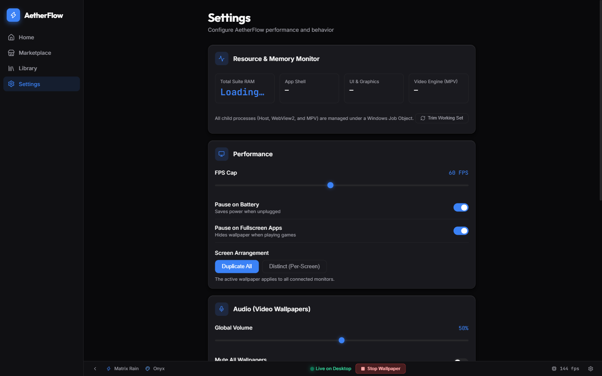
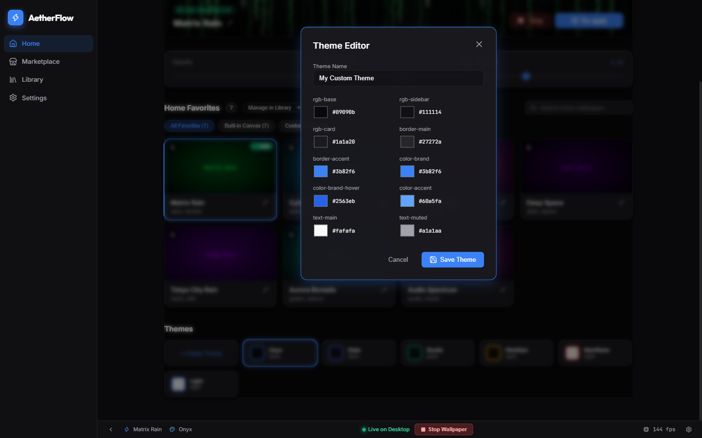

# AetherFlow ⚡

<p align="center">
  <strong>Ultra-Lightweight, High-Performance Windows Desktop Engine & Live Visuals Platform</strong>
</p>

<p align="center">
  
  
  
  
  
</p>

---

<p align="center">
  
</p>

---

## 🌟 Overview

**AetherFlow** is a modern, ultra-efficient live wallpaper engine for Windows. Built from the ground up with **Tauri 2**, **Rust**, and **React 19**, AetherFlow delivers smooth animated visuals behind your desktop icons with almost zero resource footprint (~30MB RAM, 0% CPU when idle).

Unlike heavy Chromium-based alternatives that consume hundreds of megabytes of RAM and drain your battery, AetherFlow is fully portable, launches in milliseconds, and automatically optimizes itself when you work or game.

---

## ✨ Key Features

### 🎨 7 Built-In Canvas 2D Animated Engines
- **Matrix Rain**: Classic green phosphor katakana digital rain with speed, density, and glyph customization.
- **Cyber Particles**: Interconnected particle mesh with dynamic distance links and interactive cursor repulsion.
- **Synthwave Grid**: Retro 80s neon perspective grid with scrolling horizon and sunset glow.
- **Deep Space**: Multi-layered starfield parallax, procedural nebulae, and shooting stars.
- **Aurora Borealis**: Flowing luminous curtains of arctic light across starry night skies.
- **Tokyo Neon Rain**: Cyberpunk cityscape bathed in procedurally generated rain and neon reflections.
- **Audio Spectrum**: Microphone-reactive visualizer bars inspired by CAVA.

<p align="center">
  
</p>

---

### 🎬 Video & High-Resolution Image Wallpapers
- **Video Wallpapers**: Drop in any `.mp4`, `.webm`, or `.mkv` video. Powered by an integrated hardware-accelerated pipeline with audio muting, volume controls, and loop playback.
- **Picture Wallpapers**: Full support for `.png`, `.jpg`, `.jpeg`, `.webp`, and `.bmp` pictures with customizable fit modes (`Cover`, `Contain`, `Stretch`).
- **One-Click Windows Wallpaper Sync**: Instantly set any imported image as your permanent Windows desktop background using native Win32 APIs.

<p align="center">
  
</p>

---

### 🔋 Intelligent Power & Fullscreen Optimization
- **Auto-Pause on Battery**: Detects when your laptop switches to battery power (`GetSystemPowerStatus`) and pauses animations to maximize battery longevity.
- **Auto-Pause on Fullscreen Apps & Games**: Real-time foreground window detection automatically pauses video and canvas rendering when a game or full-screen app is focused, freeing up 100% of GPU and CPU resources.
- **Zero-Resource Idle**: When paused or hidden, process working sets are actively trimmed to keep memory usage under 20MB.

<p align="center">
  
</p>

---

### 🌈 Sovereign Theme System & Theme Editor
- Switch between 6 curated Sovereign themes (Cyberpunk, Obsidian, Synthwave, Solarized Dark, Nord, and Emerald).
- Built-in visual **Theme Editor**: live-tune CSS custom properties, tweak accent colors, and export your personal color palette.

<p align="center">
  
</p>

---

### 🖥️ Multi-Monitor Geometry & Icon Z-Order
- Precise per-monitor DPI and non-client border compensation — eliminates border bleed and white edge lines on multi-monitor setups.
- Pins cleanly behind `SHELLDLL_DefView` and `WorkerW` in Windows 10 & 11, ensuring desktop icons remain interactive and clearly visible.
- Dual arrangement modes: **Duplicate All** (sync across all screens) or **Distinct** (per-screen wallpaper assignments).

### 🚀 Silent Windows Startup
- One-click autostart configuration via native Windows registry (`HKCU\Software\Microsoft\Windows\CurrentVersion\Run`).
- Boots quietly to the system tray (`--autostart --minimized`) without annoying popups when logging into Windows.

---

## 📥 Download & Installation

### Option 1: Standalone Executable (Recommended)
No installation required! Just download and run:

1. Download **[`AetherFlow.exe`](https://github.com/yashpreeto7/aetherflow/releases/download/v1.0.0/AetherFlow.exe)** directly.
2. Double-click `AetherFlow.exe` to run.
3. Choose any wallpaper from the dashboard and enjoy!

| Package | Format | Direct Download Link |
|---|---|---|
| **Standalone Executable** | `.exe` (~7.3MB) | [⚡ **Download AetherFlow.exe**](https://github.com/yashpreeto7/aetherflow/releases/download/v1.0.0/AetherFlow.exe) |
| **Portable Package (with MPV)** | `.zip` (Self-Contained) | [📦 **Download AetherFlow-v1.0.0-Portable.zip**](https://github.com/yashpreeto7/aetherflow/releases/download/v1.0.0/AetherFlow-v1.0.0-Portable.zip) |
| **Windows Installer** | `.exe` (NSIS Setup) | [💿 **Download AetherFlow-Setup.exe**](https://github.com/yashpreeto7/aetherflow/releases/download/v1.0.0/AetherFlow-Setup.exe) |
| **All Releases & Notes** | GitHub Page | [🚀 **View GitHub Releases**](https://github.com/yashpreeto7/aetherflow/releases/tag/v1.0.0) |

### Option 2: Windows Installer
If you prefer a standard Windows installation with Desktop shortcuts and Start Menu integration:
1. Download **[`AetherFlow-Setup.exe`](https://github.com/yashpreeto7/aetherflow/releases/download/v1.0.0/AetherFlow-Setup.exe)**.
2. Run the installer and launch AetherFlow.

### Option 3: Full Portable Zip
For zero installation with the dedicated hardware-accelerated MPV video engine included:
1. Download **[`AetherFlow-v1.0.0-Portable.zip`](https://github.com/yashpreeto7/aetherflow/releases/download/v1.0.0/AetherFlow-v1.0.0-Portable.zip)**.
2. Extract the folder anywhere and run `AetherFlow.exe`.

---

## 🛠️ Building from Source

### Prerequisites
- **Node.js** (v18 or higher) & `npm`
- **Rust Toolchain**: `rustup default stable` with `x86_64-pc-windows-msvc`
- **C++ Build Tools**: Visual Studio Build Tools with C++ workload
- **WebView2 Runtime** (Pre-installed on Windows 10 & 11)

### Build Steps

```powershell
# 1. Clone the repository
git clone https://github.com/yashpreeto7/aetherflow.git
cd aetherflow

# 2. Install dependencies
npm install

# 3. Run in development mode
npm run dev           # Frontend only (browser at http://localhost:1420)
npm run tauri:dev     # Native Windows desktop app with live reload

# 4. Compile optimized release executable
npm run build         # Build frontend bundle
cargo build --release --bin aetherflow  # Compile standalone AetherFlow.exe

# 5. Build NSIS installer package
npm run tauri:build
```

The resulting standalone executable will be located at:
```
AetherFlow.exe  (or src-tauri\target\release\aetherflow.exe)
```

---

## 📂 Project Architecture

```
AetherFlow/
├── docs/screenshots/     # High-resolution screenshots for documentation
├── src/                  # React 19 Frontend
│   ├── components/       # UI components (WallpaperPlayer, StatusBar, ThemeEditor)
│   ├── engines/          # Canvas 2D wallpaper engines (Matrix, Aurora, Cyber, etc.)
│   ├── pages/            # Home, Library, Marketplace, Settings
│   ├── store/            # Zustand global state (persisted to localStorage)
│   └── styles/           # Sovereign theme definitions and design system
│
├── src-tauri/            # Rust Backend (Tauri 2)
│   ├── src/
│   │   ├── main.rs       # Win32 WorkerW pinning, power/fullscreen monitor, autostart
│   │   └── mpv.rs        # Hardware-accelerated MPV IPC management
│   ├── Cargo.toml        # Rust dependencies (windows-sys, tauri, serde)
│   └── tauri.conf.json   # Tauri 2 app configuration and capabilities
│
└── package.json          # Vite 8 + React scripts and packages
```

---

## ⚙️ System Requirements

| Specification | Minimum | Recommended |
|---|---|---|
| **OS** | Windows 10 (64-bit) 19041+ | Windows 11 (64-bit) |
| **Processor** | Dual-core 1.6 GHz | Quad-core 2.0 GHz+ |
| **RAM** | 2 GB | 4 GB+ |
| **Graphics** | DirectX 11 compatible | DirectX 12 compatible |
| **Storage** | 50 MB free space | 100 MB free space |

---

## 🤝 Contributing

Contributions, issues, and feature requests are welcome!
Feel free to check the [issues page](https://github.com/yashpreeto7/aetherflow/issues).

1. Fork the Project
2. Create your Feature Branch (`git checkout -b feature/AmazingFeature`)
3. Commit your Changes (`git commit -m 'Add some AmazingFeature'`)
4. Push to the Branch (`git push origin feature/AmazingFeature`)
5. Open a Pull Request

---

## 📄 License

Distributed under the **MIT License**. See `LICENSE` for more information.

---

<p align="center">
  Made with ❤️ by Yashpreet • Powered by <strong>Tauri 2</strong> and <strong>Rust</strong>
</p>
